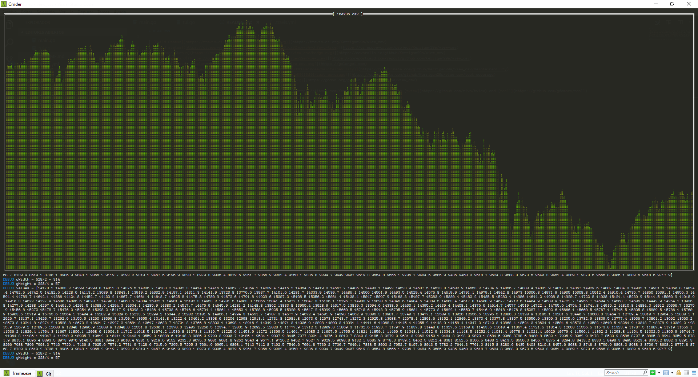

# View CSV

[](https://travis-ci.org/Kerrigan29a/view_csv)
[](https://ci.appveyor.com/project/Kerrigan29a/view-csv)
[](https://coveralls.io/github/Kerrigan29a/view_csv)
[](https://goreportcard.com/report/github.com/kerrigan29a/view_csv)
[](https://golangci.com)
[](https://codeclimate.com/github/Kerrigan29a/view_csv/maintainability)
[](https://codeclimate.com/github/Kerrigan29a/view_csv/test_coverage)
[](https://godoc.org/github.com/Kerrigan29a/view_csv)

This is an example program to test the integration of [drawille-go](https://github.com/Kerrigan29a/drawille-go) with [tview](https://github.com/rivo/tview) and [tcell](https://github.com/gdamore/tcell)

# Documentation

Documentation is available at [godoc](https://godoc.org/github.com/Kerrigan29a/view_csv)

# Example

```shell
make run ARGS="-f ibex35.csv -n Close"
```

